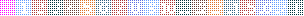
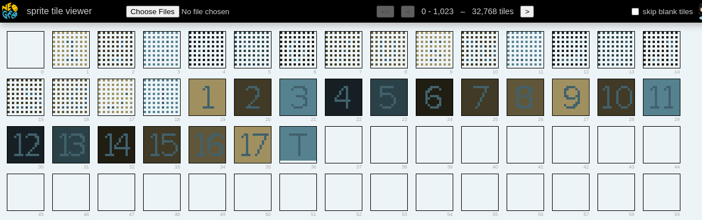
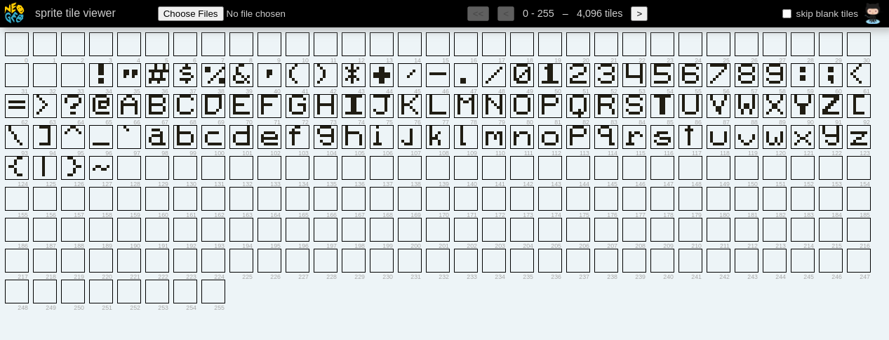
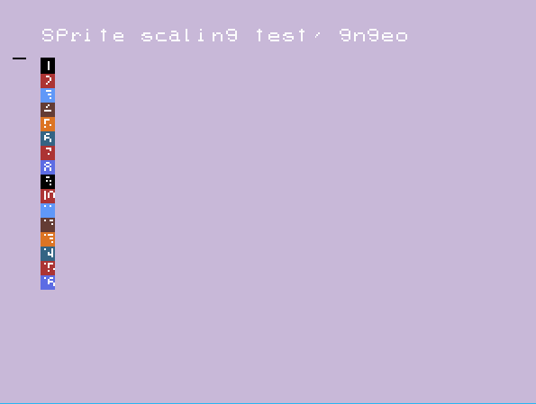
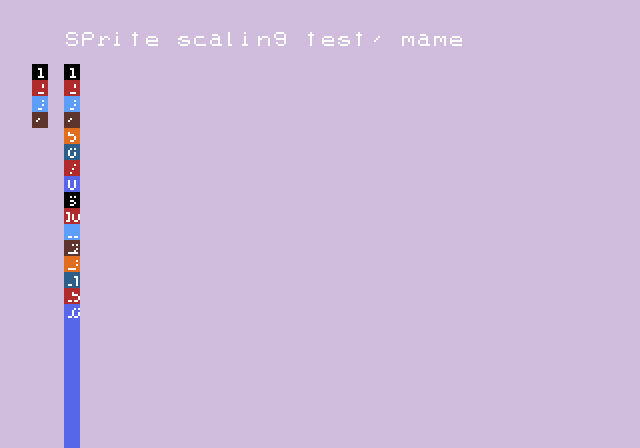

# GnGeo vs MAME

So far this repo has a tiny ngdevkit program that shows sprite scaling differences in GnGeo vs MAME.

## The S and C ROMs

Are located in the tileRoms directory. Here they are as loaded in [neospriteviewer](https://city41.github.io/neospriteviewer/)

### C ROMs

The inputs  

  

The "dotted" roms are the same images as the number tiles, but scaled down to 8x8, then the blank rows/cols are added so that when the Neo Geo scales the sprite down to 8x8, you get a cleanly scaled tile. This is commonly done in games that use tiles that are always scaled to 8x8.l

### S ROM

## GnGeo result

## MAME (0.220) result

